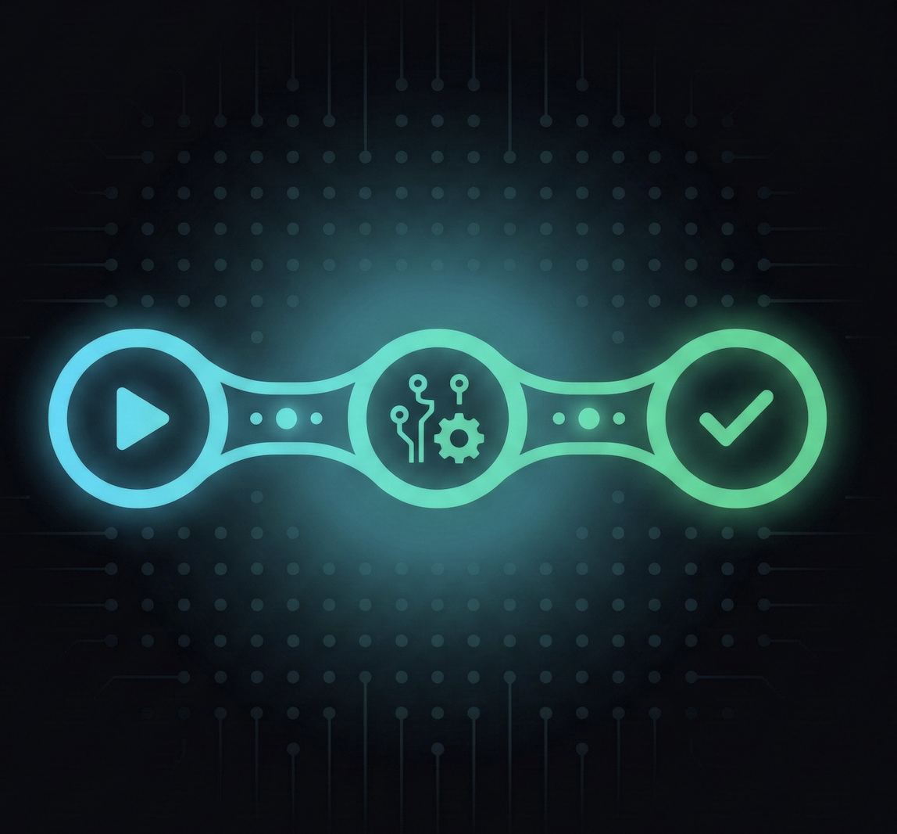
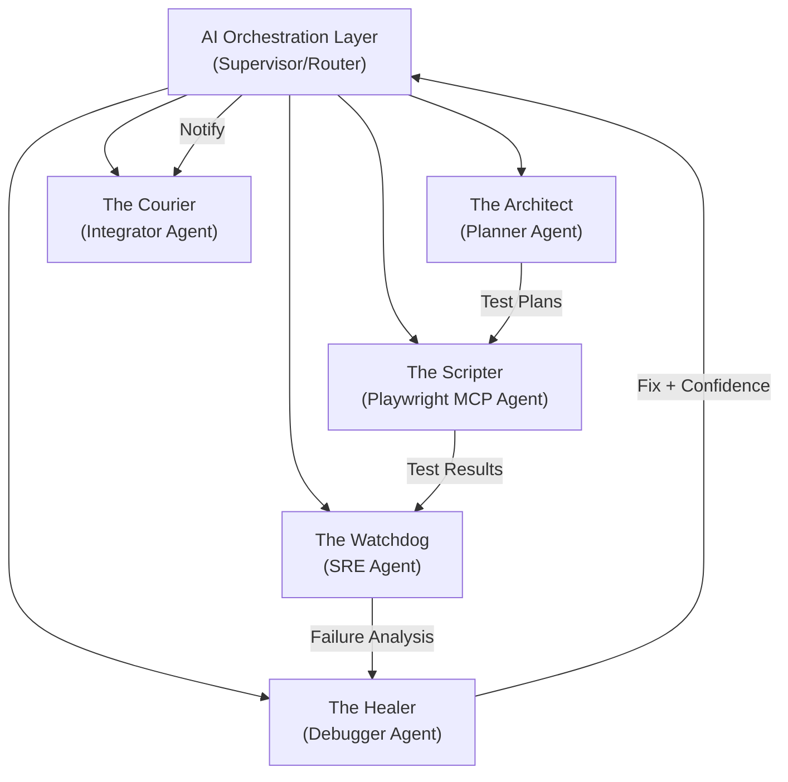

<div align="center">



# SentinelQA - Autonomous Quality Engineering

> An autonomous AI system that uses Agentic AI, LLMs, and Playwright MCP to plan, execute, monitor, and self-heal software tests independently — bridging the gap between testing and SRE.

</div>

---

## ⚡ Quick Start — Local Development

### 1. Clone & Install

```bash
git clone https://github.com/Arpit529Srivastava/Hack-karo.git
cd Hack-karo
npm install
```

### 2. Configure Environment

Create a `.env` file in the project root (see `.env.example`):

```env
# NextAuth
NEXTAUTH_URL=http://localhost:3000
NEXTAUTH_SECRET=<run: node -e "console.log(require('crypto').randomBytes(32).toString('base64'))">

# MongoDB Atlas
MONGODB_URI=mongodb+srv://<user>:<password>@cluster.mongodb.net/<dbname>

# GitHub OAuth (for dashboard login)
GITHUB_ID=<your-oauth-app-client-id>
GITHUB_SECRET=<your-oauth-app-client-secret>

# Google OAuth
GOOGLE_ID=<your-google-client-id>
GOOGLE_SECRET=<your-google-client-secret>

# GitLab OAuth
GITLAB_ID=<your-gitlab-application-id>
GITLAB_SECRET=<your-gitlab-secret>

# GitHub MCP — Personal Access Token (repo read scope)
GITHUB_PERSONAL_ACCESS_TOKEN=ghp_xxxxxxxxxxxxxxxxxxxx

# SentinelQA Agent Config
SENTINELQA_DEFAULT_OWNER=<github-org-or-username>
SENTINELQA_DEFAULT_REPO=<repo-name>
SENTINELQA_DEFAULT_BRANCH=main
SENTINELQA_TARGET_URL=http://localhost:3000
```

### 3. Start the GitHub MCP Server

The GitHub MCP server must be running for the Architect agent to read repository code and generate test plans.

**Option A — npx (recommended, no install needed):**

```bash
# Set your PAT first
# macOS/Linux:
export GITHUB_PERSONAL_ACCESS_TOKEN=ghp_xxxxxxxxxxxxxxxxxxxx

# Windows (PowerShell):
$env:GITHUB_PERSONAL_ACCESS_TOKEN="ghp_xxxxxxxxxxxxxxxxxxxx"

# Start the MCP server
npx @modelcontextprotocol/server-github
```

**Option B — Docker:**

```bash
docker run --rm -i \
  -e GITHUB_PERSONAL_ACCESS_TOKEN=ghp_xxxxxxxxxxxxxxxxxxxx \
  ghcr.io/github/github-mcp-server
```

> Keep this terminal open. The MCP server listens on stdio and must stay running alongside the Next.js app.

### 4. Start the Next.js Dashboard

Open a **new terminal** and run:

```bash
npm run dev
```

Visit **http://localhost:3000**

### 5. Trigger the Agent Pipeline (API)

With both servers running, trigger the full pipeline via the API:

```bash
curl -X POST http://localhost:3000/api/agent/pipeline \
  -H "Content-Type: application/json" \
  -d '{
    "owner": "Arpit529Srivastava",
    "repo": "Hack-karo",
    "branch": "main",
    "target_url": "http://localhost:3000",
    "github_mcp_mode": "npx"
  }'
```

Or click **"Run Pipeline"** in the dashboard at http://localhost:3000/dashboard.

---

## 🏗️ Project Structure

```
Hack-karo/
├── src/
│   ├── app/
│   │   ├── page.tsx              ← Landing page
│   │   ├── auth/page.tsx         ← Login / Signup (GitHub, Google, GitLab, Email)
│   │   ├── dashboard/page.tsx    ← Real-time agent monitoring dashboard
│   │   └── api/
│   │       ├── auth/             ← NextAuth + register endpoints
│   │       └── agent/
│   │           ├── pipeline/     ← POST — run full agent pipeline
│   │           ├── status/       ← GET  — agent health
│   │           ├── repos/        ← GET/POST — watched repos
│   │           ├── run-tests/    ← POST — execute tests directly
│   │           └── sessions/     ← GET/DELETE — session management
│   ├── lib/
│   │   ├── mongodb.ts            ← MongoDB client singleton
│   │   ├── auth.ts               ← NextAuth config
│   │   ├── mcp/
│   │   │   ├── github-client.ts  ← GitHub MCP client (JSON-RPC over stdio)
│   │   │   ├── playwright-client.ts ← Playwright MCP client
│   │   │   ├── orchestrator.ts   ← Agent orchestrator (ties all agents together)
│   │   │   ├── test-runner.ts    ← Parses & runs test plans
│   │   │   ├── repo-watcher.ts   ← Watches repos for new commits
│   │   │   └── types.ts          ← Shared TypeScript types
│   │   ├── db/users.ts           ← MongoDB user operations
│   │   └── controllers/
│   │       └── auth.controller.ts ← Auth business logic
│   └── components/               ← React components (UI, Dashboard, etc.)
├── docs/                         ← Architecture diagrams & workbooks
├── scripts/                      ← Demo scripts & simulations
└── .env                          ← Environment variables (git-ignored)
```

---

## 🤖 Agent Architecture

```
Code Push / Trigger
        ↓
THE ARCHITECT (Planner)
  → Reads repo via GitHub MCP
  → Generates test plan with Claude 3.5
        ↓
THE SCRIPTER (Playwright MCP)
  → Converts plan → Playwright TypeScript tests
  → Executes in headless Chromium
        ↓
  Tests Pass? ──YES──→ THE COURIER → Slack "All Clear"
        │
       NO
        ↓
THE WATCHDOG (SRE)
  → Queries Prometheus / Grafana / Datadog
  → Detects infrastructure anomalies
        ↓
THE HEALER (Debugger)
  → Root Cause Analysis via vector DB + Claude
  → Generates code fix with confidence score
        ↓
  Confidence >80%? ──YES──→ THE COURIER → GitHub PR + Slack
                   ──NO───→ THE COURIER → GitHub Issue + Slack
```

---

## 🔑 Getting OAuth Credentials

| Provider | Where to get credentials | Callback URL |
|---|---|---|
| **GitHub** | [github.com/settings/developers](https://github.com/settings/developers) → OAuth Apps | `http://localhost:3000/api/auth/callback/github` |
| **Google** | [console.cloud.google.com](https://console.cloud.google.com) → Credentials → OAuth Client ID | `http://localhost:3000/api/auth/callback/google` |
| **GitLab** | [gitlab.com/-/profile/applications](https://gitlab.com/-/profile/applications) — scopes: `read_user openid profile email` | `http://localhost:3000/api/auth/callback/gitlab` |
| **GitHub PAT** | [github.com/settings/tokens](https://github.com/settings/tokens) — scope: `repo` | _(used by GitHub MCP server, not OAuth)_ |

---

## 🛠️ Tech Stack

| Layer | Technology |
|---|---|
| **Frontend** | Next.js 14 (App Router), React 18, Tailwind CSS, Framer Motion, Three.js |
| **Auth** | Auth.js (NextAuth v4) — GitHub, Google, GitLab OAuth + Email/Password |
| **Database** | MongoDB Atlas (users, sessions, test traces, agent memory) |
| **AI/LLM** | Claude 3.5/4 (Anthropic) via LangGraph multi-agent orchestration |
| **MCP Servers** | GitHub MCP, Playwright MCP, Prometheus MCP, Slack MCP |
| **Testing** | Playwright (headless Chromium, accessibility-tree based) |
| **Observability** | Prometheus, Grafana, Datadog |
| **Infrastructure** | Kubernetes, Docker, GitHub Actions |

---

## 📖 Deep Research & Architecture

> The sections below are the full technical research document.

---

## 1. The Problem Space: Why SentinelQA Exists

## 1. The Problem Space: Why SentinelQA Exists

### 1.1 The "Automation Debt" Crisis

Modern engineering teams face a compounding debt:

| Problem                   | Impact                                                                                                                                   |
| ------------------------- | ---------------------------------------------------------------------------------------------------------------------------------------- |
| **Flaky/Broken Tests**    | 40-60% of E2E tests break after UI changes, costing hours of manual maintenance                                                          |
| **Blind Deployments**     | Teams ship code without full confidence; post-deploy monitoring is reactive, not proactive                                               |
| **Siloed Tooling**        | Playwright, Prometheus, GitHub, Slack exist in isolation — no unified reasoning layer                                                    |
| **MTTR Bottleneck**       | Mean Time to Recovery averages **4-6 hours** across industry; most time is spent in diagnosis (60-70% of total incident resolution time) |
| **Context Fragmentation** | When a bug is found, engineers must manually cross-reference metrics, logs, traces, recent PRs, and Slack threads                        |

### 1.2 The Vision: Autonomous Quality Engineering

SentinelQA's thesis: **An AI agent with access to the right tools (via MCP) and the right reasoning (via LangGraph) can close the entire loop** — from test generation → execution → failure detection → root cause analysis → fix → PR → notification.

This is a shift from _"AI assists testing"_ to _"AI owns the quality lifecycle."_

### 1.3 The Deployment Gate Flow (Pre-Production)

SentinelQA is **not just a production monitoring tool** — it acts as a **quality gate before production**. The primary workflow triggers during staging/canary deployments:

```
Code Push → CI Builds → Deploy to STAGING (not production)
                              ↓
                    SentinelQA kicks in:
                    1. AI writes E2E tests for the changed code
                    2. Runs tests against the staging environment
                    3. Checks ALL log sources (container logs, app logs, metrics, traces)
                    4. If everything passes → ✅ Green light to production
                    5. If something fails → ❌ Blocks deployment
                       → Performs RCA, creates fix PR, notifies team
```

This means SentinelQA **prevents bad code from reaching production** rather than just reacting to production incidents. It functions as an intelligent, AI-driven quality gate in the CI/CD pipeline.

---

## 2. The Nervous System: Model Context Protocol (MCP)

### 2.1 What is MCP?

MCP is an **open standard introduced by Anthropic (Nov 2024)** that standardizes how AI systems connect to external tools and data. It is commonly called the _"USB-C port for AI"_ — one universal interface instead of N×M custom integrations.

- **Protocol**: JSON-RPC 2.0 over STDIO or Streamable HTTP
- **Architecture**: Client → Host → Server
- **Adopted by**: Anthropic, OpenAI (March 2025), Google DeepMind, LangChain, Hugging Face
- **Donated to**: Linux Foundation's Agentic AI Foundation (AAIF) in December 2025

### 2.2 MCP Architecture for SentinelQA

```
┌─────────────────────────────────────────────────┐
│              MCP Host (SentinelQA Core)          │
│                                                  │
│  ┌──────────┐  ┌──────────┐  ┌──────────┐      │
│  │MCP Client│  │MCP Client│  │MCP Client│ ...   │
│  │(Scripter)│  │(Watchdog)│  │(Courier) │       │
│  └────┬─────┘  └────┬─────┘  └────┬─────┘      │
└───────┼──────────────┼──────────────┼────────────┘
        │              │              │
   JSON-RPC 2.0   JSON-RPC 2.0  JSON-RPC 2.0
        │              │              │
   ┌────▼────┐   ┌─────▼─────┐  ┌────▼────┐
   │Playwright│   │Prometheus │  │  Slack  │
   │MCP Server│   │MCP Server │  │MCP Srvr │
   └─────────┘   └───────────┘  └─────────┘
```

Each agent in the multi-agent squad gets its **own MCP client**, connecting to the appropriate MCP servers. This gives agents fine-grained, tool-scoped access.

### 2.3 Available MCP Servers (Relevant to SentinelQA)

| MCP Server         | Capabilities                                                                                         | Maturity                            |
| ------------------ | ---------------------------------------------------------------------------------------------------- | ----------------------------------- |
| **Playwright MCP** | Browser automation via accessibility tree, not screenshots. Planner/Generator/Healer agents built-in | ✅ Production-ready (by Microsoft)  |
| **GitHub MCP**     | Read repos, manage issues, create PRs, analyze code                                                  | ✅ Official (open-source by GitHub) |
| **Prometheus MCP** | Execute PromQL, list/discover metrics, troubleshoot infra                                            | ✅ Available (PyPI, Docker)         |
| **Grafana MCP**    | Dashboard management, data source querying, alerting                                                 | ✅ Official (by Grafana Labs)       |
| **Datadog MCP**    | Query logs/metrics/traces, investigate incidents via natural language                                | ⚠️ Preview                          |
| **Slack MCP**      | Search messages, send notifications, manage channels                                                 | ✅ Available (via user tokens)      |

> [!IMPORTANT]
> This is the critical insight: **SentinelQA doesn't need to build custom integrations**. The MCP ecosystem already provides standardized bridges. The value-add is the _reasoning layer on top_.

### 2.4 Key Technical Considerations

- **Security**: Prompt injection and tool permission attacks are documented concerns (April 2025 security audit). SentinelQA must implement scoped tool access per agent role and human-in-the-loop confirmation for destructive actions (e.g., merging a PR).
- **Transport**: Use STDIO for local MCP servers (Playwright, on the same K8s pod) and Streamable HTTP for remote servers (GitHub, Slack, Datadog cloud APIs).
- **Dynamic Tool Discovery**: Agents can discover available tools at runtime — enabling hot-plugging of new MCP servers without redeployment.

---

## 3. The Brain: Multi-Agent Orchestration with LangGraph

### 3.1 Why LangGraph?

LangGraph (by LangChain) is the leading framework for **stateful, graph-based multi-agent orchestration**. Unlike simple chain-of-thought pipelines, LangGraph supports:

- **Cyclic workflows** — agents can loop, retry, and backtrack
- **Shared state** — all agents read/write to a unified `StateGraph`
- **Conditional routing** — dynamic branching based on agent output
- **Checkpointing** — persistent memory for long-running workflows
- **Human-in-the-loop** — breakpoints where human approval is required

### 3.2 SentinelQA's Agent Squad — Mapping to LangGraph Patterns

The five agents map to a **Supervisor + Specialist** pattern:



#### Agent Responsibilities & LangGraph Node Design

| Agent             | Role                                                                  | MCP Servers Used                                   | LangGraph Pattern                       |
| ----------------- | --------------------------------------------------------------------- | -------------------------------------------------- | --------------------------------------- |
| **The Architect** | Analyzes codebase/requirements → generates test plans                 | GitHub MCP                                         | Planner node                            |
| **The Scripter**  | Converts test plans → executable Playwright scripts, runs them        | Playwright MCP                                     | Executor node                           |
| **The Watchdog**  | Monitors observability stack, detects anomalies post-deploy/post-test | Prometheus MCP, Grafana MCP, Datadog MCP           | Watcher node (event-driven)             |
| **The Healer**    | Performs RCA on failures, generates code fixes                        | GitHub MCP, Playwright MCP (for DOM introspection) | Debugger node (cycles back to Scripter) |
| **The Courier**   | Creates PRs, files issues, sends Slack notifications                  | GitHub MCP, Slack MCP                              | Output node                             |

### 3.3 The LangGraph State Machine — A Typical Flow

```
1. TRIGGER: New deployment detected / scheduled test run / manual trigger from dashboard
      ↓
2. ARCHITECT: Reads repo via GitHub MCP → generates test plan (Markdown)
      ↓
3. SCRIPTER: Converts plan → Playwright test scripts → executes in headless browser cluster
      ↓
4. DECISION NODE: All tests pass?
     ├─ YES → COURIER: Sends "All Clear" to Slack, updates dashboard
     └─ NO  → WATCHDOG: Queries Prometheus/Grafana for correlated anomalies
                  ↓
              5. HEALER: Receives test failure + observability context
                 → Performs RCA (analyzes error, DOM snapshot, metrics)
                 → Generates code fix
                 → Confidence score > threshold?
                   ├─ YES → COURIER: Creates GitHub PR with fix, notifies on Slack
                   └─ NO  → COURIER: Creates GitHub Issue with RCA report, pages oncall via Slack
```

### 3.4 LangGraph State Schema (Conceptual)

```python
class SentinelState(TypedDict):
    # Trigger context
    trigger_type: str  # "deployment" | "scheduled" | "manual"
    repo_url: str
    branch: str
    commit_sha: str

    # Architect output
    test_plan: str  # Markdown
    test_plan_approved: bool

    # Scripter output
    test_scripts: list[str]  # Generated Playwright scripts
    test_results: list[TestResult]

    # Watchdog context
    metrics_snapshot: dict  # PromQL results
    anomalies_detected: list[Anomaly]

    # Healer output
    rca_report: str
    proposed_fix: str  # Code diff
    confidence_score: float

    # Courier output
    pr_url: str | None
    issue_url: str | None
    slack_notification_sent: bool
```

### 3.5 Critical Design Decisions

1. **Supervisor vs. Swarm**: Use **Supervisor** pattern. QA workflows are inherently sequential with conditional branches, not emergent/decentralized. The Orchestration Layer acts as the router.

2. **LLM Selection**: Claude 3.5/4 is the primary LLM. Key reasons:
   - Native MCP support (Anthropic created MCP)
   - Strong code generation and reasoning
   - Large context window for full test plan + codebase analysis

3. **Human-in-the-Loop Gates**: The Healer should **never auto-merge** fixes. The flow should be: generate PR → human reviews → merge. Confidence score determines whether it's a PR (high confidence) or an Issue (low confidence).

4. **Checkpointing**: Enable LangGraph checkpointing so that if any agent fails mid-flow, the entire pipeline can resume from the last checkpoint rather than restarting.

---

## 4. Playwright MCP — The Testing Foundation

### 4.1 How Playwright MCP Works

Playwright MCP is **fundamentally different** from traditional Playwright scripting:

| Traditional Playwright              | Playwright MCP                                               |
| ----------------------------------- | ------------------------------------------------------------ |
| Developer writes selectors manually | AI reads the **accessibility tree** (DOM)                    |
| Tests break when UI changes         | AI **adapts dynamically** to UI changes                      |
| Static scripts                      | **Outcome-driven** instructions                              |
| `page.click('#submit-btn')`         | `"Click the Submit button"` (AI resolves to correct element) |

The MCP server provides:

- **Accessibility snapshots**: Semantic, hierarchical view of all UI elements (roles, labels, states)
- **Real-time DOM introspection**: The AI understands what's on screen without screenshots
- **Tool actions**: Navigate, click, type, evaluate JS, assert conditions

### 4.2 Playwright's Built-in AI Agent Triad

Playwright itself ships three agent types that map directly to SentinelQA's needs:

| Playwright Agent    | Maps to SentinelQA Agent | Function                                                                                                 |
| ------------------- | ------------------------ | -------------------------------------------------------------------------------------------------------- |
| **Planner Agent**   | The Architect            | Explores app, identifies user workflows, generates test plans in Markdown                                |
| **Generator Agent** | The Scripter             | Converts test plans → executable Playwright TypeScript/JavaScript tests; verifies selectors in real-time |
| **Healer Agent**    | The Healer               | Detects broken tests, analyzes DOM changes, auto-repairs test scripts                                    |

> [!TIP]
> This alignment is not coincidental — it means SentinelQA can **leverage Playwright's native agent infrastructure** rather than reinventing the wheel. The value of SentinelQA is wrapping this with the observability feedback loop (Prometheus/Datadog) and the automated remediation (GitHub PRs).

### 4.3 Playwright MCP Language Support

**Playwright MCP generates tests in TypeScript/JavaScript only.** This is because the MCP server is built on the Node.js Playwright library, and the Generator agent outputs `.spec.ts` files.

| Language              | Playwright Library Support | Playwright MCP Test Generation |
| --------------------- | -------------------------- | ------------------------------ |
| TypeScript/JavaScript | ✅                         | ✅ (native)                    |
| Python                | ✅                         | ❌                             |
| Java                  | ✅                         | ❌                             |
| C#                    | ✅                         | ❌                             |

**Why this isn't a limitation for SentinelQA:**

- **Test scripts** → Always TypeScript (generated by Playwright MCP)
- **The application being tested** → Can be in **any language** (Go, Python, Java, Rust, etc.). Tests interact with the browser/UI, so the backend language is irrelevant.
- **Code fixes** (generated by the Healer agent via Claude LLM) → Written in **whatever language your project uses**. Claude can generate fixes in Go, Python, Java, TypeScript, or any language.

In summary: Playwright MCP handles the **testing layer** (always TS), while the Healer's **code fix generation** is language-agnostic because it's powered by the LLM, not Playwright.

### 4.4 Containerized Browser Execution

For K8s deployment:

- Run headless Chromium in Docker containers (`mcr.microsoft.com/playwright` image)
- Each test session → one ephemeral K8s pod with a browser container
- Scale horizontally: run N parallel test suites across N pods
- Go agent (Scripter) orchestrates pod lifecycle via K8s API
- Playwright MCP server runs as a sidecar in each pod

---

## 5. The Observability Feedback Loop

### 5.1 Pluggable Log & Observability Sources

> [!IMPORTANT]
> Logs and errors are **not limited to Prometheus or Datadog**. They can live in many different places depending on the team's stack. The Watchdog agent must be **pluggable** — able to connect to whatever observability source the team uses.

| Source                       | What It Contains                                 | How SentinelQA Accesses It       |
| ---------------------------- | ------------------------------------------------ | -------------------------------- |
| **Prometheus**               | Metrics (CPU, memory, error rates, latency)      | Prometheus MCP Server            |
| **Grafana**                  | Dashboards, alerts, annotations                  | Grafana MCP Server               |
| **Datadog**                  | Logs, traces, APM, anomaly detection             | Datadog MCP Server               |
| **Container logs**           | `kubectl logs` — stdout/stderr of containers     | Custom MCP server or K8s API     |
| **Application logs**         | `console.log`, `logger.error` — app-level logs   | File-based or log aggregator MCP |
| **CI/CD pipeline logs**      | GitHub Actions, Jenkins, ArgoCD                  | GitHub MCP / custom MCP          |
| **Cloud provider logs**      | AWS CloudWatch, GCP Cloud Logging, Azure Monitor | Cloud-specific MCP server        |
| **APM / Distributed traces** | Jaeger, Zipkin, OpenTelemetry traces             | Trace Viewer MCP / OTel MCP      |
| **Custom log files**         | App-specific log files on disk                   | File system MCP                  |

The architecture should treat observability sources as **plugins** — the Watchdog agent connects to whichever MCP servers are configured for the team's stack. This makes SentinelQA adaptable to any infrastructure setup.

### 5.2 The Integration Stack

```
┌───────────────────────────────────────┐
│         The Watchdog Agent            │
│   (Pluggable via MCP Servers)         │
└───────────┬───────────────────────────┘
            │
    ┌───────▼───────────────────────┐
    │      Pluggable Event Sources  │
    ├───────────────────────────────┤
    │ • Prometheus MCP  → Metrics   │
    │ • Grafana MCP     → Dashboards│
    │ • Datadog MCP     → Logs/APM  │
    │ • K8s Logs MCP    → Container │
    │ • CloudWatch MCP  → Cloud     │
    │ • OTel/Jaeger MCP → Traces    │
    │ • Custom MCP      → Anything  │
    └───────────────────────────────┘
```

### 5.3 How the Watchdog Agent Works

1. **Prometheus MCP**: Execute PromQL queries in natural language. Example: _"Show me the p99 latency for the `/api/checkout` endpoint over the last 30 minutes"_ → translates to `histogram_quantile(0.99, rate(http_request_duration_seconds_bucket{path="/api/checkout"}[30m]))`

2. **Grafana MCP**: Programmatically read dashboard panels, check alert states, create annotations when SentinelQA runs a test cycle.

3. **Datadog MCP**: Search distributed traces for error patterns, correlate deployment events with metric anomalies, retrieve log entries filtered by service/status.

### 5.4 The Self-Healing Feedback Loop

This is the **core differentiator** of SentinelQA:

```
Deploy → Watchdog detects anomaly (e.g., error rate spike from 0.1% to 5%)
    ↓
Watchdog pulls context: recent deployment SHA, affected service, error traces
    ↓
Healer performs RCA:
  - Reads the diff of the recent commit (via GitHub MCP)
  - Correlates with error traces (via Datadog MCP)
  - Identifies root cause (e.g., "null check removed in line 47 of checkout.ts")
    ↓
Healer generates fix + confidence score
    ↓
Courier: Creates PR with fix OR creates Issue with RCA report
Courier: Notifies team on Slack with full context
```

### 5.5 MTTR Impact

Industry benchmarks for AI-driven observability:

- **40-60% MTTR reduction** with AI-driven observability (IR.com research)
- **81% reduction in diagnosis phase** specifically (Metoro.io data)
- **30-70% faster resolution** compared to manual workflows (Rootly research)

SentinelQA targets the diagnosis phase specifically, which constitutes 60-70% of total incident resolution time. By automated RCA, the expected MTTR reduction is **50-70%**.

---

## 6. Go + Kubernetes — The Execution Infrastructure

### 6.1 Why Go for Agent Orchestration?

| Requirement            | Go Advantage                                                              |
| ---------------------- | ------------------------------------------------------------------------- |
| High concurrency       | Goroutines handle thousands of concurrent agents/test sessions            |
| K8s native             | K8s itself is written in Go; `client-go` is the best-supported K8s client |
| Low latency            | Compiled binary, no runtime overhead (vs. Python/Node.js)                 |
| Container-friendly     | Static binaries produce minimal Docker images                             |
| Production reliability | Strong type system, built-in error handling                               |

### 6.2 Architecture: Go Services

| Service          | Responsibility                                                | Key Libraries                                                                   |
| ---------------- | ------------------------------------------------------------- | ------------------------------------------------------------------------------- |
| **Orchestrator** | LangGraph state machine execution, agent lifecycle management | `client-go`, gRPC, custom LangGraph runtime (or HTTP calls to Python LangGraph) |
| **Test Runner**  | Manages K8s pods for headless Playwright execution            | `client-go`, `chromedp` (fallback)                                              |
| **MCP Gateway**  | Routes MCP calls from agents to appropriate MCP servers       | JSON-RPC, HTTP/WebSocket                                                        |
| **API Server**   | REST/GraphQL API for the Next.js frontend                     | `gin` or `fiber`, PostgreSQL                                                    |

### 6.3 Hybrid Go + Node.js Architecture

> [!WARNING]
> **Key architectural decision**: LangGraph is a Python/TypeScript framework. You have two options:

**Option A: Python LangGraph + Go Services (Recommended)**

- LangGraph orchestration runs as a Python service
- Go handles K8s orchestration, MCP gateway, and API serving
- Communication via gRPC between Go and Python services
- **Pro**: Native LangGraph with full feature support
- **Con**: Polyglot complexity

**Option B: Port LangGraph concepts to Go**

- Implement a custom state machine in Go inspired by LangGraph
- **Pro**: Single-language stack
- **Con**: Must reimplement LangGraph features (checkpointing, conditional edges, human-in-the-loop)

**Recommendation**: Option A. LangGraph's ecosystem (LangSmith tracing, LangGraph Cloud) provides too much value to rewrite.

### 6.4 Kubernetes Architecture

```yaml
# Namespace: sentinelqa
Deployments:
  - orchestrator (Go, 2 replicas)
  - langgraph-engine (Python, 2 replicas)
  - mcp-gateway (Node.js, 2 replicas)
  - api-server (Go, 3 replicas)
  - frontend (Next.js, 2 replicas)

Jobs (Ephemeral):
  - playwright-test-pod (per test session)
    - Container 1: headless-chromium
    - Container 2: playwright-mcp-server (sidecar)
    - Container 3: test-runner (Go or Node.js)

StatefulSets:
  - postgresql (1 replica, PVC)

ConfigMaps:
  - mcp-server-registry (URLs and auth for all MCP servers)

Secrets:
  - github-token
  - slack-token
  - datadog-api-key
  - anthropic-api-key
```

---

## 7. SaaS Frontend — Next.js Agentic Dashboard

### 7.1 Aesthetic: "Cyber-Engineering" Dark Mode

The dashboard should feel like a **mission control center for quality engineering**:

- **Base**: Deep dark background (`#0a0a0f` to `#12121a`)
- **Accent**: Neon cyan (`#00f5ff`) for primary actions and live data
- **Secondary**: Electric purple (`#7b2ffa`) for secondary elements
- **Glass panels**: `backdrop-filter: blur(12px)` with `rgba(255,255,255,0.05)` backgrounds
- **Typography**: `JetBrains Mono` for terminal/code, `Inter` for UI text
- **Animations**: Subtle grid pulse background, particle field (Three.js/react-three-fiber)

### 7.2 Dashboard Pages & Components

#### Main Command Center

- **Agent Squad Status**: 5 cards showing each agent's state (idle/running/error), current task, and last action
- **Live Test Terminal**: Real-time WebSocket-streamed terminal output showing Playwright test execution
- **Metrics Sparklines**: Embedded Grafana panels (via `<iframe>` or Grafana embed API) showing key metrics
- **Recent Activity Feed**: Timeline of agent actions (PR created, test generated, anomaly detected)

#### Test Management

- **Test Plans**: Architect-generated test plans with approval workflow
- **Test Results**: Pass/fail history with trend visualization
- **Coverage Map**: Visual representation of tested vs. untested user flows

#### Incidents & Remediation

- **RCA Reports**: Healer-generated root cause analysis with linked code diffs
- **PR Tracker**: Status of auto-generated PRs (open/merged/rejected)
- **MTTR Dashboard**: Historical MTTR metrics with before/after SentinelQA comparison

#### Landing Page ("The Hook")

- **Live Simulation**: Animated sequence showing:
  1. A code change is pushed _(GitHub animation)_
  2. The Architect generates a test plan _(typing animation)_
  3. The Scripter runs the test → failure detected _(terminal animation)_
  4. The Healer analyzes and generates a fix _(code diff animation)_
  5. The Courier opens a PR and notifies Slack _(notification animation)_
- All of this in a **30-second loop** — no user interaction needed

### 7.3 Agentic UX Principles

| Principle         | Implementation                                                                                        |
| ----------------- | ----------------------------------------------------------------------------------------------------- |
| **Invisibility**  | Agents work in the background; dashboard shows results, not mechanics                                 |
| **Transparency**  | Every agent action is logged and explainable — click any action to see the full reasoning chain       |
| **Human Control** | Approval gates for PR merges and test plan acceptance                                                 |
| **Proactiveness** | Dashboard surfaces "Recommended Actions" (e.g., _"3 tests are flaky — want the Healer to fix them?"_) |

### 7.4 Real-Time Architecture

```
Next.js Frontend  ←──WebSocket──→  API Server (Go)
                                       ↕
                              LangGraph Engine (Python)
                                       ↕
                                  MCP Gateway
```

- **WebSocket** for live terminal output and agent status updates
- **Server-Sent Events (SSE)** as fallback for simpler streaming
- **React Query / SWR** for polling-based data (test history, metrics)
- **Three.js / react-three-fiber** for the 3D particle background

---

## 8. Competitive Landscape & Positioning

### 8.1 Direct Competitors

| Tool                      | Approach                             | SentinelQA Differentiator                           |
| ------------------------- | ------------------------------------ | --------------------------------------------------- |
| **Applitools Autonomous** | Visual AI + NLP test authoring       | No observability integration, no self-healing infra |
| **Katalon TrueTest**      | AI test gen from real user journeys  | No RCA, no automated remediation                    |
| **Virtuoso QA**           | NLP scripting + self-healing tests   | No deployment monitoring loop                       |
| **ACCELQ Autopilot**      | GenAI test automation lifecycle      | No MCP, no multi-agent architecture                 |
| **Testsigma Atto**        | Low-code + AI coworkers              | No infrastructure observability                     |
| **Mabl**                  | AI-native test automation + adaptive | No GitHub PR generation, no root cause analysis     |

### 8.2 SentinelQA's Unique Position

None of the existing tools close the **full loop**:

```
       Existing Tools               SentinelQA
       ─────────────               ──────────
Test Generation    ✅                  ✅
Test Execution     ✅                  ✅
Self-Healing Tests ✅                  ✅
Infra Monitoring   ❌                  ✅ (via Prometheus/Grafana/Datadog MCP)
Root Cause Analysis❌                  ✅ (Healer agent)
Auto-Remediation   ❌                  ✅ (generates code fixes)
PR Creation        ❌                  ✅ (via GitHub MCP)
Team Notification  ❌                  ✅ (via Slack MCP)
```

### 8.3 Market Opportunity

- **75% of companies** will adopt AI-driven test automation by 2025 (Gartner)
- AI-powered testing market projected at **$9.9 billion by 2034**
- Current solutions address testing alone — **none offer the observability ↔ remediation feedback loop**
- Target buyers: **CTOs and Lead Developers** at Series B+ companies running microservices on K8s

---

## 9. Technical Risks & Mitigations

| Risk                                 | Severity  | Mitigation                                                                                      |
| ------------------------------------ | --------- | ----------------------------------------------------------------------------------------------- |
| **LLM Hallucination in Code Fixes**  | 🔴 High   | Confidence scoring + mandatory human review of all PRs; never auto-merge                        |
| **MCP Security Vulnerabilities**     | 🟡 Medium | Scoped tool permissions per agent; no destructive MCP actions without human approval            |
| **Cost of Claude API calls**         | 🟡 Medium | Caching test plans; batching related queries; using smaller models for simple routing decisions |
| **Playwright Test Flakiness**        | 🟡 Medium | Retry logic; accessibility-tree-based selectors are inherently more stable than CSS selectors   |
| **LangGraph Python ↔ Go Complexity** | 🟡 Medium | Clear gRPC contracts; containerize each service independently                                   |
| **Kubernetes Resource Costs**        | 🟡 Medium | Ephemeral pods for test execution; scale-to-zero when idle                                      |

---

## 10. Recommended Approach — Build Phases

### Phase 1: Core Loop (MVP)

> Get one end-to-end flow working: trigger → generate test → execute → report results

- Set up LangGraph with Architect + Scripter agents
- Integrate Playwright MCP for test generation and execution
- Integrate GitHub MCP for code reading
- Basic Next.js dashboard with agent status + test results
- Deploy on local Docker Compose

### Phase 2: Observability Integration

> Add the Watchdog agent with monitoring capabilities

- Integrate Prometheus MCP + Grafana MCP
- Watchdog agent monitors post-deployment metrics
- Correlation between test failures and metric anomalies
- Grafana sparklines embedded in dashboard

### Phase 3: Self-Healing

> Add the Healer and Courier agents for automated remediation

- Healer performs RCA using code diffs + error traces
- Healer generates code fix proposals with confidence scores
- Courier creates GitHub PRs and Slack notifications
- Human-in-the-loop approval workflow

### Phase 4: Production Polish

> Hardening, scaling, and the premium SaaS experience

- Deploy on Kubernetes with full manifest
- Go services for high-concurrency orchestration
- Premium landing page with live simulation
- Auth, billing, multi-tenancy
- Datadog MCP integration (when it exits preview)

---

## 11. Key Takeaways from Research

1. **MCP is the right bet** — industry adoption is accelerating (OpenAI, Google, Linux Foundation). All the MCP servers SentinelQA needs already exist.

2. **LangGraph Supervisor pattern** perfectly maps to the 5-agent squad. Use conditional edges for pass/fail routing and checkpointing for resilience.

3. **Playwright MCP's built-in Planner/Generator/Healer agents** directly correspond to three of SentinelQA's five agents — massive leverage.

4. **The competitive gap is clear** — existing AI testing tools stop at test generation/execution. Nobody offers the observability → RCA → auto-remediation → PR creation loop.

5. **Go + K8s** is the right choice for the infrastructure layer (native K8s client, high concurrency), but LangGraph should stay in Python to leverage the full ecosystem.

6. **Start with Docker Compose, not K8s** — validate the agent loop works before adding K8s complexity. Phase 1 should prove the core AI reasoning, not the infrastructure.
