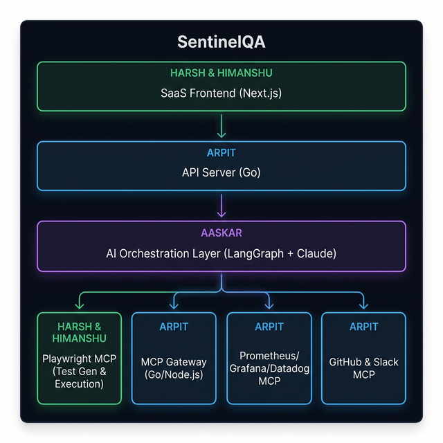
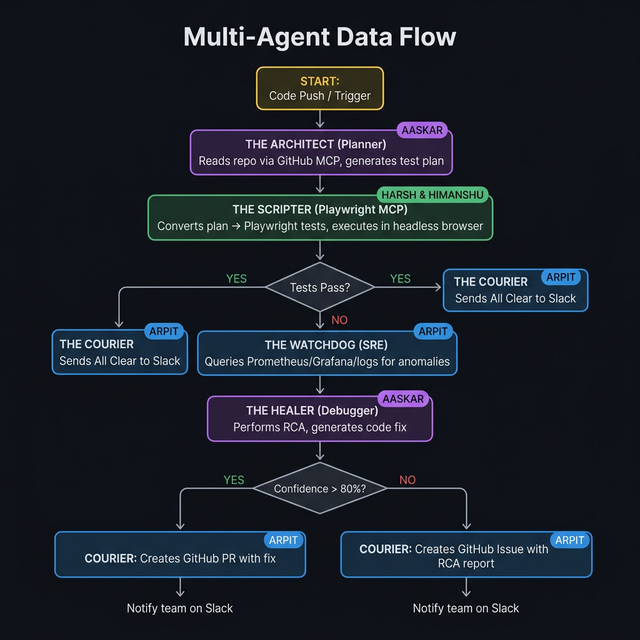
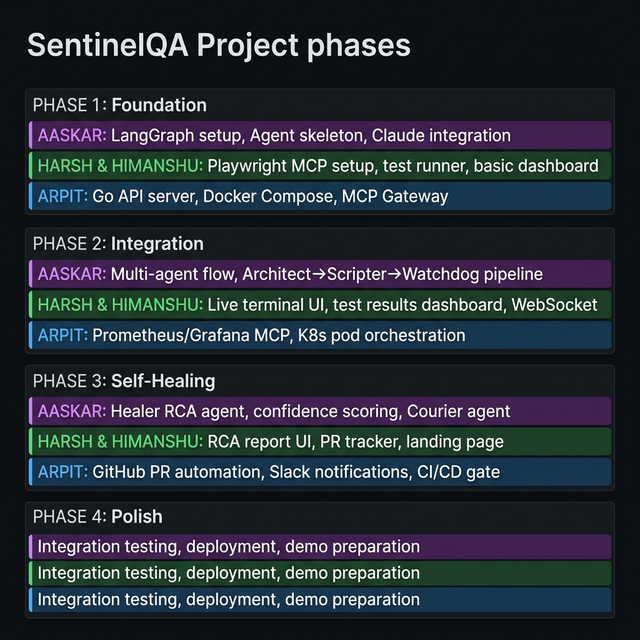

# SentinelQA — Work Distribution & Team Guide

> **Project**: SentinelQA — Autonomous Quality Engineering Platform  
> **Team**: Arpit (Lead/Infra), Aaskar (AI Engineer), Harsh & Himanshu (Fullstack)  
> **Date**: March 2026

---

## Architecture Ownership Map



### Color Legend

- 🟣 **Purple (Aaskar)**: AI Orchestration — LangGraph, Claude, Multi-Agent Brain
- 🟢 **Green (Harsh & Himanshu)**: Playwright MCP + Next.js Frontend
- 🔵 **Blue (Arpit)**: Go Backend, MCP Gateway, Observability, GitHub/Slack Integrations

---

## Agent Flow & Ownership



---

## Project Timeline



---

## Team Assignments Summary

| Component                    | Owner                | Tech Stack                       | Doc                                                      |
| ---------------------------- | -------------------- | -------------------------------- | -------------------------------------------------------- |
| AI Orchestration Layer       | **Aaskar**           | Python, LangGraph, Claude API    | [aaskar_workbook.md](aaskar_workbook.md)                 |
| Playwright MCP + Test Runner | **Harsh & Himanshu** | Node.js, TypeScript, Playwright  | [harsh_himanshu_workbook.md](harsh_himanshu_workbook.md) |
| Next.js Frontend Dashboard   | **Harsh & Himanshu** | Next.js, React, WebSocket        | [harsh_himanshu_workbook.md](harsh_himanshu_workbook.md) |
| Go API Server                | **Arpit**            | Go, Gin/Fiber, PostgreSQL        | [arpit_workbook.md](arpit_workbook.md)                   |
| MCP Gateway                  | **Arpit**            | Go/Node.js, JSON-RPC             | [arpit_workbook.md](arpit_workbook.md)                   |
| Observability MCP Servers    | **Arpit**            | Prometheus, Grafana, Datadog MCP | [arpit_workbook.md](arpit_workbook.md)                   |
| GitHub & Slack MCP           | **Arpit**            | GitHub API, Slack API, MCP       | [arpit_workbook.md](arpit_workbook.md)                   |
| Slack Notification Service   | **Himanshu**         | TypeScript, Slack Incoming Webhook, Block Kit | [SLACK_INTEGRATION.md](SLACK_INTEGRATION.md) |
| Docker/K8s Infrastructure    | **Arpit**            | Docker Compose, Kubernetes       | [arpit_workbook.md](arpit_workbook.md)                   |

---

## How the Team Connects

```
HARSH & HIMANSHU                    ARPIT                         AASKAR
(Frontend + Playwright)             (Infra + Gateway)             (AI Brain)
─────────────────────               ────────────────              ──────────
Next.js Dashboard  ←──WebSocket──→  Go API Server  ←───gRPC───→  LangGraph Engine
                                         │                            │
                                    MCP Gateway  ←──JSON-RPC──→  Agent MCP Calls
                                         │
Playwright MCP  ←──────MCP Protocol──────┘
                                         │
                           Prometheus/Grafana/GitHub/Slack MCP
```

### Integration Points (Where You Talk to Each Other)

| From → To                   | Interface                      | What Gets Exchanged                                          |
| --------------------------- | ------------------------------ | ------------------------------------------------------------ |
| **Aaskar → Harsh/Himanshu** | LangGraph calls Playwright MCP | Test plans (Markdown) → Playwright generates & runs TS tests |
| **Harsh/Himanshu → Arpit**  | WebSocket + REST API           | Dashboard fetches agent status, test results, metrics        |
| **Aaskar → Arpit**          | gRPC / REST                    | Agent state updates, trigger events, RCA reports             |
| **Arpit → Aaskar**          | Event triggers                 | Deployment events, metric anomalies → trigger agent pipeline |
| **Arpit → Harsh/Himanshu**  | WebSocket push                 | Live terminal output, agent status changes, notifications    |

---

## Quick Start (Just Get Things Running)

### Day 1 — Everyone

```bash
# Clone the repo
git clone <repo-url>
cd Hack-karo

# Create your branch
git checkout -b feat/<your-name>/initial-setup
```

### Day 1 — Aaskar

```bash
# Set up Python environment
python3 -m venv venv && source venv/bin/activate
pip install langgraph langchain-anthropic langchain-core

# Get an Anthropic API key (ask Arpit)
export ANTHROPIC_API_KEY="sk-..."

# Run: Get a basic LangGraph "Hello World" agent working
```

### Day 1 — Harsh & Himanshu

```bash
# Set up Playwright MCP
npm init -y
npm install @playwright/test playwright
npx playwright install chromium

# Set up Next.js
npx -y create-next-app@latest frontend --typescript --tailwind --app --no-src-dir

# Run: Get Playwright running a basic test on any website
```

### Day 1 — Arpit

```bash
# Set up Go API server
mkdir -p cmd/api && go mod init github.com/sentinelqa/server
go get github.com/gin-gonic/gin

# Set up Docker Compose skeleton
touch docker-compose.yml

# Run: Get a basic Go API responding on :8080
```

---

## Communication Rules

1. **Daily 10-min sync** — What you did, what's blocked, what you need from others
2. **Integration PRs** — When connecting two components (e.g., Aaskar's agent → Harsh's Playwright), make a joint PR
3. **Shared contracts first** — Before building, agree on the data shape (JSON schema) between your components
4. **Feature branches** — `feat/<name>/<feature>`, merge to `dev`, never to `main` directly

---

## Individual Workbooks

Each team member has a detailed workbook with:

- What to research and learn
- Step-by-step tasks per phase
- Resources and documentation links
- Expected deliverables

👉 **[Aaskar's Workbook (AI Engineer)](aaskar_workbook.md)**  
👉 **[Harsh & Himanshu's Workbook (Fullstack)](harsh_himanshu_workbook.md)**  
👉 **[Arpit's Workbook (Infra/Lead)](arpit_workbook.md)**
